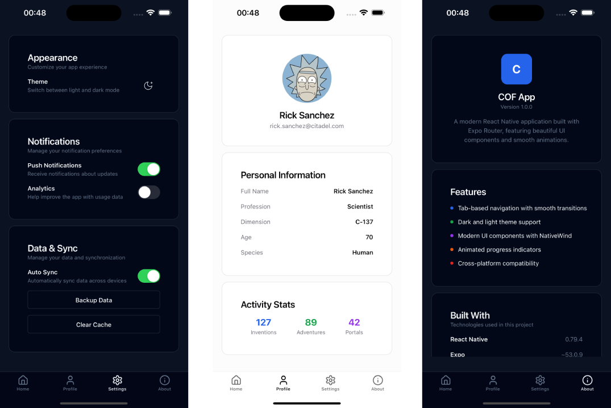

# React Native Starter with Expo & NativeWind

A modern, feature-rich React Native starter template built with Expo, TypeScript, NativeWind (Tailwind CSS), and React Native Reusables. Perfect for quickly starting new mobile applications with a solid foundation and beautiful UI components.

> **Built upon [React Native Reusables](https://github.com/mrzachnugent/react-native-reusables)** - An amazing collection of copy-and-paste React Native components built with NativeWind and inspired by shadcn/ui. This starter extends the original template with additional features and screens.

## 📱 Preview


## 🚀 Features

### 📱 **Navigation & Layout**
- **Tab-based navigation** with Expo Router
- **Safe Area support** for all devices (notch, Dynamic Island, etc.)
- **Headerless design** for modern app experience
- **4 pre-built tabs**: Home, Profile, Settings, About

### 🎨 **UI & Theming**
- **NativeWind v4** - Tailwind CSS for React Native
- **Dark and light mode** with system preference detection
- **Slate color scheme** for sophisticated dark mode
- **Persistent theme** across app restarts
- **Android Navigation Bar** matches theme mode

### 🧩 **Components & Reusables**
- **React Native Reusables** - High-quality, accessible components
- **Pre-built UI components**: 
  - Avatar with fallback support
  - Buttons with variants
  - Cards with headers, content, and footers
  - Progress indicators with animations
  - Text components with proper styling
  - Tooltips with customizable content
  - Theme toggle switch

### 🛠 **Development Experience**
- **TypeScript** for type safety
- **Expo Router** for file-based routing
- **React Native Reanimated** for smooth animations
- **Lucide React Native** for beautiful icons
- **ESLint & Prettier** ready (configurable)

### 📊 **Pre-built Screens**
- **Home Dashboard**: Progress tracking, stats, interactive elements
- **Profile Screen**: User information, activity stats, avatar management
- **Settings Screen**: Theme toggle, notifications, security, account management
- **About Screen**: App info, tech stack, support links, legal information

## 📦 Tech Stack

- **[React Native](https://reactnative.dev/)** `0.79.4` - Mobile app framework
- **[Expo](https://expo.dev/)** `~53.0.9` - Development platform and tools
- **[Expo Router](https://docs.expo.dev/router/introduction/)** `~5.1.1` - File-based navigation
- **[TypeScript](https://www.typescriptlang.org/)** `^5.8.3` - Type safety
- **[NativeWind](https://www.nativewind.dev/)** `^4.1.23` - Tailwind CSS for React Native
- **[React Native Reusables](https://github.com/mrzachnugent/react-native-reusables)** - UI component library
- **[React Native Reanimated](https://docs.swmansion.com/react-native-reanimated/)** `~3.17.5` - Animations
- **[Lucide React Native](https://lucide.dev/)** `^0.511.0` - Icon library
- **[React Native Safe Area Context](https://github.com/th3rdwave/react-native-safe-area-context)** `5.4.0` - Safe area handling

## 🏁 Quick Start

### Prerequisites
- Node.js 18+ 
- npm or yarn
- Expo CLI (`npm install -g @expo/cli`)
- iOS Simulator (for iOS development)
- Android Studio & Android SDK (for Android development)

### Installation

1. **Clone or download this starter template**
   ```bash
   git clone <your-repo-url>
   cd your-project-name
   ```
   
   > **Note**: This starter is based on the excellent work from [React Native Reusables](https://github.com/mrzachnugent/react-native-reusables). You can also start directly from their template and add the features from this repo manually.

2. **Install dependencies**
   ```bash
   npm install
   # or
   yarn install
   ```

3. **Start the development server**
   ```bash
   npm run dev
   # or
   yarn dev
   ```

4. **Run on your preferred platform**
   ```bash
   # iOS Simulator
   npm run ios
   
   # Android Emulator
   npm run android
   
   # Web browser
   npm run web
   ```

## 📱 Available Scripts

```bash
npm run dev          # Start Expo development server
npm run dev:web      # Start web development server
npm run dev:android  # Start Android development server
npm run dev:ios      # Start iOS development server
npm run android      # Build and run on Android
npm run ios          # Build and run on iOS
npm run web          # Build and run on web
npm run clean        # Clean cache and node_modules
```

## 🏗 Project Structure

```
├── app/                     # App screens and navigation
│   ├── (tabs)/             # Tab-based screens
│   │   ├── _layout.tsx     # Tab navigation layout
│   │   ├── index.tsx       # Home screen
│   │   ├── profile.tsx     # Profile screen
│   │   ├── settings.tsx    # Settings screen
│   │   └── about.tsx       # About screen
│   ├── _layout.tsx         # Root layout
│   ├── +not-found.tsx     # 404 screen
│   └── index.tsx           # Root redirect
├── components/             # Reusable components
│   ├── ui/                # UI component library
│   │   ├── avatar.tsx
│   │   ├── button.tsx
│   │   ├── card.tsx
│   │   ├── progress.tsx
│   │   ├── text.tsx
│   │   └── tooltip.tsx
│   └── ThemeToggle.tsx    # Theme switching component
├── lib/                   # Utilities and configurations
│   ├── icons/            # Custom icon components
│   ├── constants.ts      # App constants and theme
│   ├── utils.ts          # Utility functions
│   └── useColorScheme.tsx # Color scheme hook
├── assets/               # Static assets
├── global.css           # Global styles and CSS variables
└── package.json         # Dependencies and scripts
```

## 🎨 Customization

### Theme Colors
Edit `lib/constants.ts` and `global.css` to customize your color scheme:

```typescript
// lib/constants.ts
export const NAV_THEME = {
  light: { /* your light theme colors */ },
  dark: { /* your dark theme colors */ }
};
```

### Adding New Tabs
1. Create a new screen file in `app/(tabs)/`
2. Add the tab configuration in `app/(tabs)/_layout.tsx`
3. Import your preferred icon from `lucide-react-native`

### Modifying Components
All UI components are located in `components/ui/` and can be customized to match your design requirements.

## 🚢 Deployment

### Expo Application Services (EAS)
```bash
# Install EAS CLI
npm install -g eas-cli

# Configure your project
eas build:configure

# Build for production
eas build --platform all
```

### Manual Build
```bash
# Generate native code
npx expo prebuild

# Build with Xcode (iOS) or Android Studio (Android)
```

## 🤝 Contributing

1. Fork the repository
2. Create your feature branch (`git checkout -b feature/amazing-feature`)
3. Commit your changes (`git commit -m 'Add some amazing feature'`)
4. Push to the branch (`git push origin feature/amazing-feature`)
5. Open a Pull Request

## 📄 License

This project is licensed under the MIT License - see the [LICENSE](LICENSE) file for details.

## 🙏 Acknowledgments

- **[React Native Reusables](https://github.com/mrzachnugent/react-native-reusables)** by [@mrzachnugent](https://github.com/mrzachnugent) - This starter is built upon their incredible foundation. They deserve all the credit for the beautiful component library and the original starter template.
- **[shadcn/ui](https://ui.shadcn.com/)** - The inspiration for the component design system
- **[NativeWind](https://www.nativewind.dev/)** for bringing Tailwind CSS to React Native
- **[Expo](https://expo.dev/)** for the amazing development platform
- **[Lucide](https://lucide.dev/)** for the beautiful icon set

### 🌟 Original Creator
Special thanks to **[@mrzachnugent](https://github.com/mrzachnugent)** for creating React Native Reusables. This starter simply extends their work with additional screens and features. Please check out the [original repository](https://github.com/mrzachnugent/react-native-reusables) and give it a star! ⭐

## 📞 Support

If you have any questions or need help, please:

- Check the [Expo Documentation](https://docs.expo.dev/)
- Visit [React Native Reusables Documentation](https://github.com/mrzachnugent/react-native-reusables)
- Check [NativeWind Documentation](https://www.nativewind.dev/)
- Open an issue in this repository

---

**Happy coding! 🚀**

Built with ❤️ using React Native, Expo, and modern mobile development tools.

**Based on the amazing work by [@mrzachnugent](https://github.com/mrzachnugent) - [React Native Reusables](https://github.com/mrzachnugent/react-native-reusables)**
